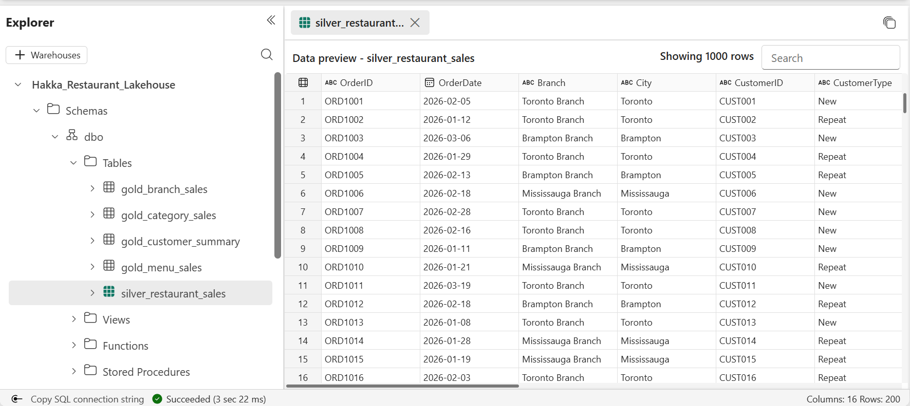
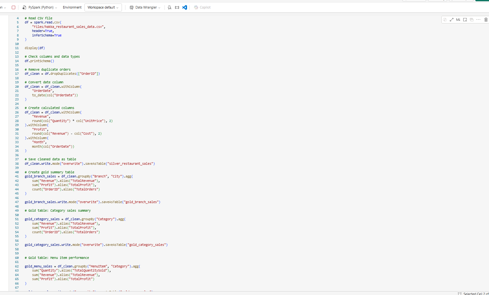
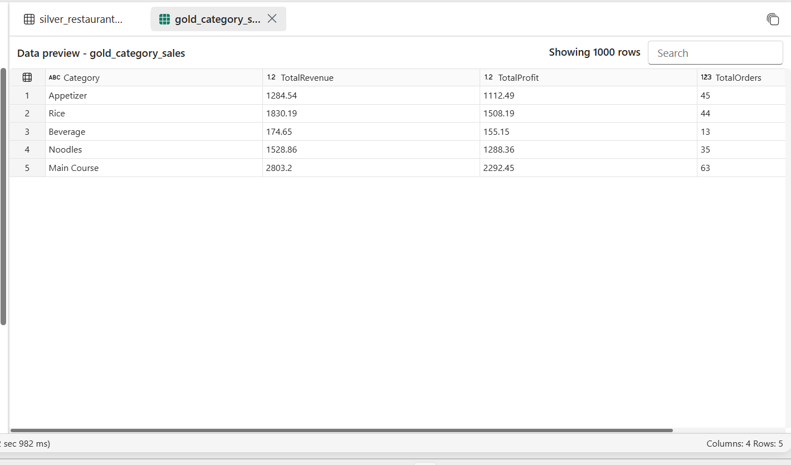

# Canadian Restaurant Sales Analytics Dashboard

## Project Overview

This project demonstrates an end-to-end restaurant sales analytics solution using Microsoft Fabric and Power BI.

The objective is to ingest restaurant sales data, transform and validate it using Python and PySpark in Microsoft Fabric Notebooks, store the prepared data in a Lakehouse, and build interactive Power BI dashboards for business reporting and decision-making.

## Tools & Technologies

- Microsoft Fabric
- Lakehouse
- Data Pipelines
- Notebooks
- Python
- PySpark
- SQL
- Power BI
- Excel
- Power Automate
- GitHub

## Business Problem

Restaurant data is often spread across multiple files and systems, making it difficult to track sales performance, customer trends, and operational KPIs.

This project centralizes the data and provides actionable insights through reporting and dashboards.

## Project Screenshots
### Microsoft Fabric Lakehouse

### PySpark Notebook

### Gold Layer Output

## Project Status
 In Progress
